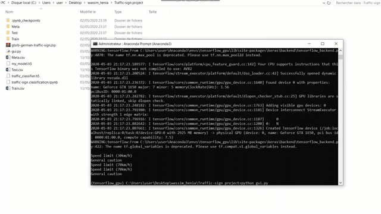

# Traffic Sign Classification

I have finished a traffic sign classification project which is useful for all autonomous vehicles.

The model is able to identify traffic signs from the image with 95% accuracy, I have trained it the GTSRB dataset that contains 43 different traffic sign classes.

Also, I have built a graphical user interface for the traffic signs classifier with Tkinter.

link to the dataset: 
https://drive.google.com/file/d/1BGDHe6qQwrBEgnl-tXTSKo6TvDj8U3wS/view
